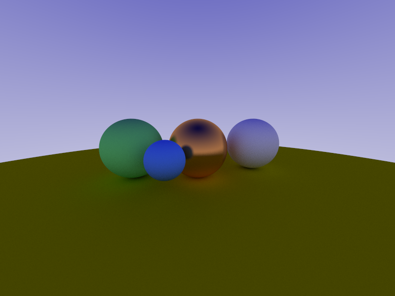
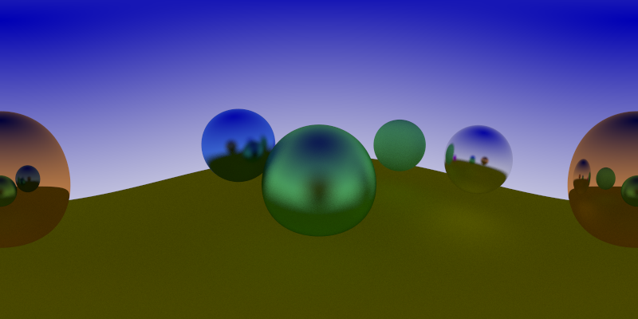
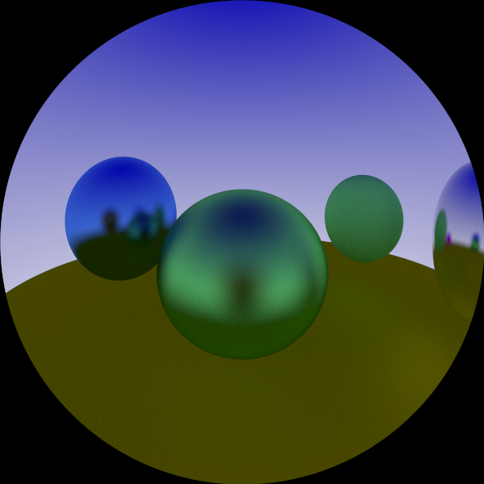
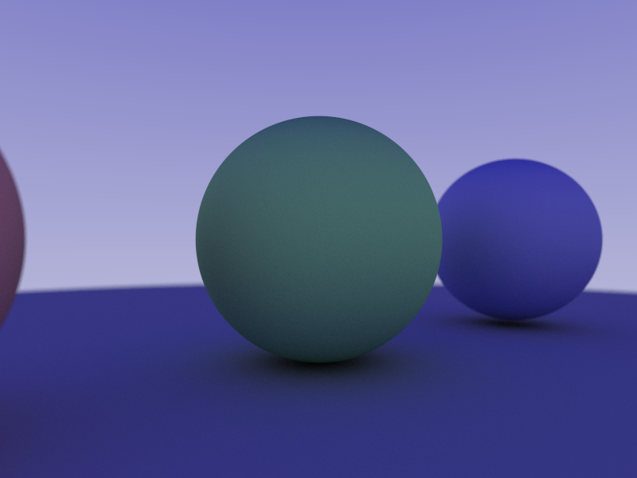

This is a raytracer that I am building it is kind of a running project and will add things that I think are interesting. Some of the techniques that I use are original (see source code!)
and some of them are taken from approaches seen in The Blog At The Bottom of The Sea (methods for calculating depth of field) and Ray Tracing In One Weekend (hittable and hittable_list design, math for sphere geometries and different materials). This is not a complete list but both Peter Shirley's and my implementations are public so feel free to compare the two!

The project supports antialiasing, camera roll pitch yaw and translation, glass, matte, and metal surfaces, and lighting. The project also supports fisheye lenses, spherical sensors, and flat sensors with depth of field.

Currently I am working on optimizing the rendering loop on one core. 

In the future I hope to add some parallelism either with openMP (since it is more simple), but if I have more time this summer, using C++'s STD libraries for managing threads and mutex's. 

# Flat Camera
Cute little family

  

 

# Spherical Camera
Notice the wrap around! That Sphere is BEHIND the camera.

  

 

# Fisheye Lens
Album cover for The Spheres 

  

 

# Depth Of Field
Spheres all lined up!

  

 
